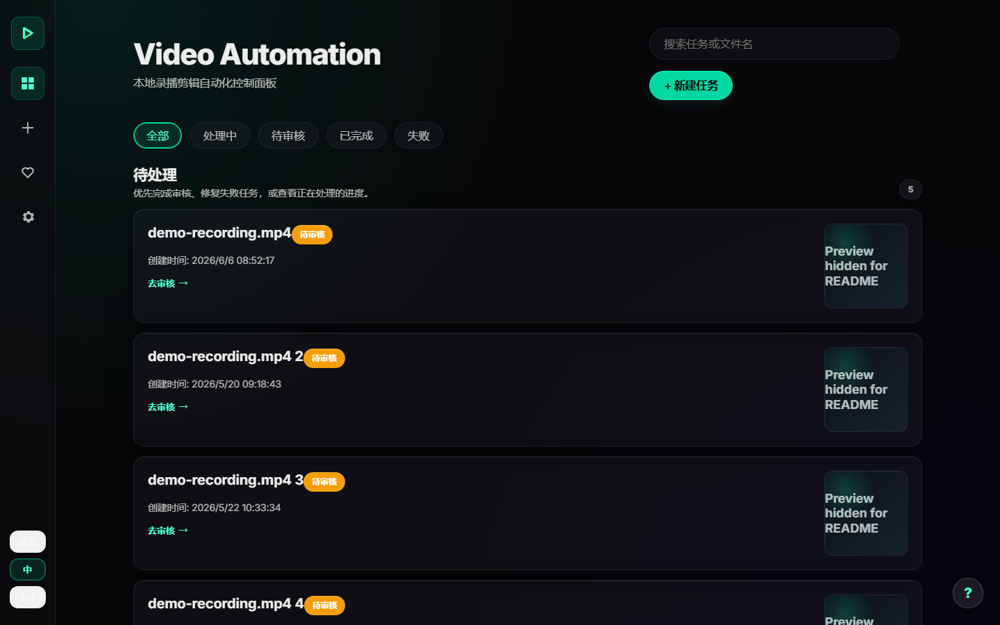

# Video Automation

[](LICENSE)
[](https://www.python.org/)
[](https://ffmpeg.org/)

**中文说明：[README.zh-CN.md](README.zh-CN.md)**

Turn a long local recording into a reviewed short video with transcript, subtitles, cover images, and export files. Everything runs on your computer unless you choose an external AI service.



> Video Automation accepts local video files. URL downloading and livestream recording are not included. Original files are never modified, and platform login or automatic publishing is disabled by default.

## Start in 5 Minutes

### Windows app (recommended)

1. Download the latest Windows package from [GitHub Releases](https://github.com/1076184145/video-automation/releases).
2. Install or unzip it, then run `VideoAutomationLite.exe`.
3. Open **Health**. If FFmpeg or FFprobe is missing, click **Auto-fix Dependencies**.
4. Open **New Job** and add one local video.
5. Choose a profile such as **Fast**, **Douyin**, or **Bilibili**, then start processing.
6. Open the finished job, review it, and download `final.mp4`.

The basic workflow does not require an API key.

### Run from source

Requirements:

- Python 3.11 or newer
- FFmpeg and FFprobe available on `PATH`
- Git
- Optional: an NVIDIA GPU for faster transcription and rendering

Windows PowerShell:

```powershell
git clone https://github.com/1076184145/video-automation.git
cd video-automation
py -m venv venv
.\venv\Scripts\python.exe -m pip install --upgrade pip
.\venv\Scripts\python.exe -m pip install -r requirements-transcription-faster.txt
.\venv\Scripts\python.exe .\run_worker.py --serve
```

macOS or Linux:

```bash
git clone https://github.com/1076184145/video-automation.git
cd video-automation
python3 -m venv venv
./venv/bin/python -m pip install --upgrade pip
./venv/bin/python -m pip install -r requirements-transcription-faster.txt
./venv/bin/python run_worker.py --serve
```

The recommended command installs the leaner Faster-Whisper runtime used by the default configuration. `requirements.txt` keeps the compatible OpenAI Whisper CLI fallback. FunASR with Faster-Whisper fallback uses `requirements-transcription-funasr.txt`; desktop packaging, Pillow, Demucs, and other extras remain in `requirements-optional.txt`.

Create a separate Linux virtual environment inside WSL. A Windows virtual
environment cannot be reused by WSL Python.

Open [http://127.0.0.1:8765/#/](http://127.0.0.1:8765/#/) in your browser. Keep the terminal window open while using the app.

### Optional local Hugging Face AI

Choose models from available VRAM rather than copying one machine's configuration. These are conservative starting points for one active model at a time with 1–2 GB of VRAM left free:

| Free VRAM | Local text model | Local reference-image model | System RAM |
|---|---|---|---|
| CPU or under 6 GB | 1B–3B GGUF, Q4 | CPU offload or external service; 512–768 px | 16 GB+ |
| 8 GB | 7B–8B GGUF, Q4 | 2B–4B, 4-bit; up to 768 px | 24–32 GB |
| 12–16 GB | 12B–14B GGUF, Q4/Q5 | 4B–8B, 4-bit; 768–1024 px | 32 GB+ |
| 24 GB+ | 20B–32B GGUF, Q4/Q5 | 8B–12B, 4/8-bit; up to 1024 px | 64 GB+ |

Browse [text-generation models](https://huggingface.co/models?pipeline_tag=text-generation&sort=trending) and [image-to-image models](https://huggingface.co/models?pipeline_tag=image-to-image&sort=trending), verify each model's license and runtime compatibility, then install `requirements-local-ai.txt` and [llama.cpp](https://github.com/ggml-org/llama.cpp/releases). Keep the selected IDs, paths, weights, manifests, caches, logs, and benchmarks in the ignored local `.env`, `models/`, `config/`, and runtime folders; only generic guidance belongs in Git.

## Daily Workflow

1. **Import:** drag in a local video or select one from `input/recordings`.
2. **Choose:** select a profile and enable only the options you need.
3. **Process:** the app inspects the video, transcribes speech, suggests cuts, and renders selected outputs.
4. **Review:** preview clips, edit cuts or transcript text, and rerun when needed.
5. **Export:** download the final video, subtitles, cover, or manual publish package.

Profiles are starting points:

| Profile | Use it for |
|---|---|
| **Fast** | A quick final video with less optional analysis |
| **Analysis** | Transcript and detection results without a full export |
| **Douyin** | Vertical short-video output |
| **Bilibili** | Standard Bilibili-oriented output |
| **YouTube Shorts** | Vertical Shorts output |

## Features

Included in the local workflow:

- Single and batch video import
- Job progress, restart recovery, and a persistent task queue
- Stage-aware progress, durable retries, and cooperative cancel/delete controls
- Speech transcription with Whisper-compatible local backends
- Silence, freeze, scene, and damaged-frame checks
- Suggested cuts, transcript editing, line-bounded subtitles, and a horizontally scrollable clip editor
- Bounded local clip-boundary refinement that avoids partial words without increasing invalid-media coverage
- Browser preview plus full-quality `final.mp4`
- Vertical `1080x1920` output and subtitle burn-in
- Projects, reusable recipes, creator settings, and review revisions
- Purposeful enter/exit motion for routes, dialogs, lists, and disclosures, with reduced-motion support
- Premiere Pro and Jianying/CapCut handoff files
- Manual upload packages for supported platforms

Optional features:

- AI covers, translation, titles, descriptions, and semantic highlight suggestions
- NVIDIA CUDA/NVENC acceleration
- Faster-Whisper local transcription (`medium` primary, `small` fallback by default); legacy FunASR configurations remain supported
- Demucs audio separation
- A separately configured publishing connector; manual packages remain the fallback

External AI features require a key from the provider you select; local Hugging
Face mode does not. Keys entered in
**Settings** are stored in the operating-system credential store; the private
`.env` contains only a reference. Existing plaintext `.env` keys can be migrated
from the warning shown in **Settings**. See [`.env.example`](.env.example) for
available settings.

Semantic highlight analysis samples the full transcript and returns precise
intervals; those intervals drive the highlight cut and cover context instead of
expanding back to whole structural clips. With OpenRouter image models that
support references, cover generation locally extracts one frame from the
top-ranked semantic intervals, preferring a clear centered subject over repeated
or split-screen layouts, and sends it with the cover prompt only when you
explicitly run the external cover feature.
Failed semantic-provider attempts preserve the last good `highlights.json` and
write only provider, model, status, and a stable error code to
`highlights_attempt.json`; prompts, transcripts, and API keys are not stored there.

Transcription runs in an isolated process with phase heartbeats, a no-progress
timeout, process-tree cleanup, and a temporary backend circuit breaker. A failed
model attempt therefore advances to the configured fallback instead of blocking
the queue for the full duration-derived timeout.

Transcription language defaults to automatic detection. Choose a fixed language
only when every recording in the job or batch uses that language; forcing the
wrong language can produce plausible-looking but incorrect subtitles. Before
subtitle generation, invalid Unicode replacement markers and obvious
single-character decoder loops are removed from ASR output.

## Important Outputs

Each job is stored under `processing/jobs/<job-name>/`.

| File | What it is |
|---|---|
| `final.mp4` | Full-quality finished video |
| `web_preview.mp4` | Smaller browser preview |
| `transcript.txt` / `.srt` | Transcript and subtitles |
| `cuts.json` | Suggested or edited clip ranges |
| `highlights.json` / `highlight_cut.json` | Semantic highlight decisions and the duration-bounded render cut |
| `highlights_attempt.json` | Last semantic-provider attempt status and privacy-safe error code |
| `clip_refinement.json` | Deterministic boundary-check attempts, scores, and recovery state |
| `highlight_thumbnail.jpg` | Local reference frame selected for grounded cover generation |
| `cover_*.jpg` | Generated or selected covers |
| `publish_packages/` | Files and text for manual upload |
| `project_exports/` | Premiere Pro or Jianying/CapCut handoff files |

## Troubleshooting

**The app says FFmpeg or FFprobe is missing**

Open **Health** and use **Auto-fix Dependencies**. Source users can run:

```powershell
.\venv\Scripts\python.exe .\run_worker.py --health
```

**The first job is slow**

Speech models may download and initialize on first use. Later jobs reuse local model files and can start faster.

**A running job does not stop immediately after I click Cancel**

Cancellation is cooperative: the job first changes to **Canceling** while the active transcription or render subprocess is terminated and its resources are released. If the app was interrupted, restart it and use the recovery or delete action shown for the stale job.

**CUDA or GPU processing fails**

Choose a smaller speech model or switch transcription/rendering to CPU in **Settings**.

**An AI button reports a missing key**

The local editing workflow still works. Configure a provider key only if you want that AI feature.

**Where are my jobs?**

Open `processing/jobs/`. Do not commit this folder, `.env`, logs, private videos, or generated exports to Git.

## Developer Commands

```powershell
# Show every CLI option
.\venv\Scripts\python.exe .\run_worker.py --help

# Machine-readable health check
.\venv\Scripts\python.exe .\run_worker.py --health --json

# Process one local file
.\venv\Scripts\python.exe .\run_worker.py --once "D:\path\video.mp4" --profile douyin --progress

# Preview old completed-job cleanup without deleting anything
.\venv\Scripts\python.exe .\run_worker.py --cleanup-days 30 --cleanup-mode intermediates --dry-run

# Reclaim only audio caches and temporary files from completed jobs
.\venv\Scripts\python.exe .\run_worker.py --cleanup-days 30 --cleanup-mode intermediates

# Run Python tests
.\venv\Scripts\python.exe -m unittest discover -s tests
```

The local Web server binds to `127.0.0.1:8765` by default. Non-loopback bindings
are rejected unless `API_ALLOW_REMOTE=true` is set explicitly. That flag is not
authentication: remote use still requires a firewall, authenticated reverse
proxy, and HTTPS. Contribution guidance is in [CONTRIBUTING.md](CONTRIBUTING.md).

## Privacy and Boundaries

- Videos, jobs, and provider keys stay on your computer by default.
- External AI features send only the required request and credential directly to the provider you choose.
- The project does not operate an intermediary server or a remote self-update service.
- Manual publish packages do not log in or upload automatically.
- You are responsible for the rights to process and publish your media.

Report security issues privately as described in [SECURITY.md](SECURITY.md).

## License

Video Automation is available under the [MIT License](LICENSE). Third-party tools, models, fonts, and APIs may have separate terms; see [NOTICE](NOTICE).
