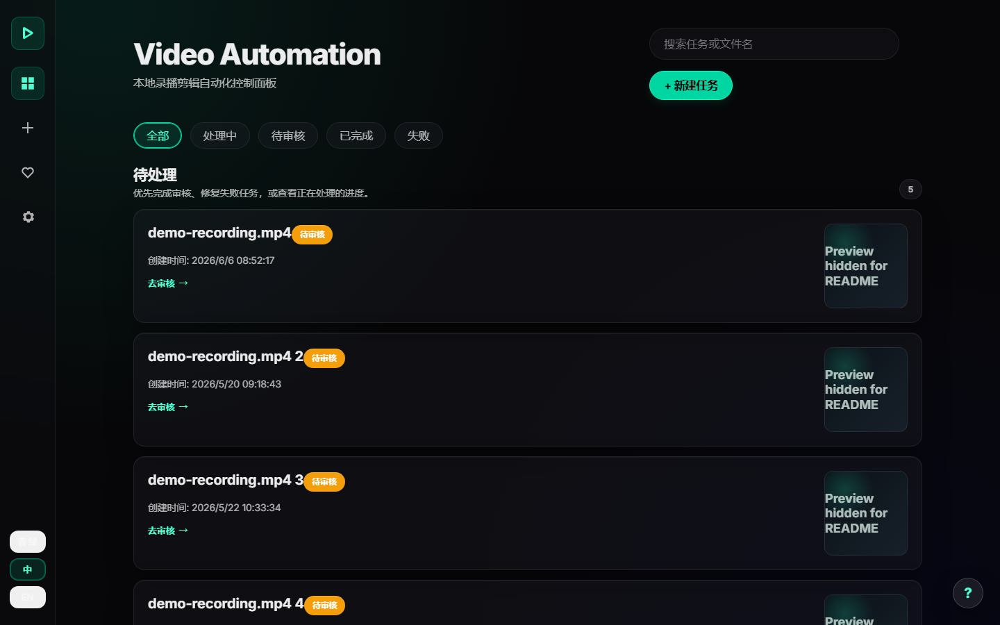

# Video Automation

[](LICENSE)
[](https://www.python.org/)
[](https://ffmpeg.org/)

**English: [README.md](README.md)**

把本地长视频整理成可以审核的短视频，并生成转写文本、字幕、封面和导出文件。除非你主动使用外部 AI 服务，否则所有处理都在自己的电脑上完成。



> Video Automation 只接收本地视频文件，不提供 URL 下载和直播录制。软件不会修改原视频，平台登录和自动发布默认关闭。

## 5 分钟开始使用

### Windows 桌面版（推荐）

1. 从 [GitHub Releases](https://github.com/1076184145/video-automation/releases) 下载最新 Windows 安装包或压缩包。
2. 安装或解压后，运行 `VideoAutomationLite.exe`。
3. 打开 **健康检查**。如果缺少 FFmpeg 或 FFprobe，点击 **一键修复环境**。
4. 打开 **新建任务**，添加一个本地视频。
5. 选择 **极速模式**、**抖音** 或 **B 站** 等预设，然后开始处理。
6. 打开完成的任务，审核结果并下载 `final.mp4`。

基础流程不需要 API Key。

### 从源码运行

需要准备：

- Python 3.11 或更高版本
- 已加入 `PATH` 的 FFmpeg 和 FFprobe
- Git
- 可选：NVIDIA 显卡，用于加速转写和渲染

Windows PowerShell：

```powershell
git clone https://github.com/1076184145/video-automation.git
cd video-automation
py -m venv venv
.\venv\Scripts\python.exe -m pip install --upgrade pip
.\venv\Scripts\python.exe -m pip install -r requirements-transcription-faster.txt
.\venv\Scripts\python.exe .\run_worker.py --serve
```

macOS 或 Linux：

```bash
git clone https://github.com/1076184145/video-automation.git
cd video-automation
python3 -m venv venv
./venv/bin/python -m pip install --upgrade pip
./venv/bin/python -m pip install -r requirements-transcription-faster.txt
./venv/bin/python run_worker.py --serve
```

推荐命令安装默认配置使用的轻量 Faster-Whisper 环境；`requirements.txt` 保留
兼容性较好的 OpenAI Whisper CLI 回退。FunASR 加 Faster-Whisper 回退使用
`requirements-transcription-funasr.txt`。桌面打包、Pillow、Demucs 等完整可选
组件仍在 `requirements-optional.txt`。

WSL 必须单独创建 Linux 虚拟环境，不能直接复用 `D:\` 下的 Windows `venv`。

浏览器打开 [http://127.0.0.1:8765/#/](http://127.0.0.1:8765/#/)。使用期间不要关闭运行服务的终端窗口。

## 日常使用流程

1. **导入：** 拖入本地视频，或从 `input/recordings` 选择已有文件。
2. **选择：** 选择工作流预设，只开启自己需要的选项。
3. **处理：** 软件检查视频、转写语音、建议剪辑点，并生成选中的产物。
4. **审核：** 预览片段，修改剪辑点或转写文本，需要时重新运行。
5. **导出：** 下载最终视频、字幕、封面或手动发布包。

预设只是推荐起点：

| 预设 | 适合场景 |
|---|---|
| **极速模式** | 尽快生成成片，减少可选分析 |
| **只分析** | 只要转写和检测结果，不急着导出完整视频 |
| **抖音** | 竖屏短视频 |
| **B 站** | 常规 B 站视频 |
| **YouTube Shorts** | 竖屏 Shorts 视频 |

## 功能

本地流程已经包含：

- 单个或批量导入视频
- 任务进度、重启恢复和持久化任务队列
- 分阶段进度、持久化重试，以及可靠的取消和删除操作
- 使用 Whisper 兼容本地后端进行语音转写
- 静音、静止画面、场景切换和坏帧检查
- 剪辑建议、转写文本编辑、字幕行数硬限制，以及可横向滚动的剪辑表
- 本地有界剪辑边界精修：避免截断词语，同时不增加无效画面覆盖
- 浏览器预览和完整质量的 `final.mp4`
- 竖屏 `1080x1920` 输出和内嵌字幕
- 项目、可复用配方、创作者设置和审核版本
- Premiere Pro 与剪映/CapCut 交接文件
- 支持平台的手动上传包

可选功能：

- AI 封面、字幕翻译、标题简介和高光建议
- NVIDIA CUDA/NVENC 加速
- Faster-Whisper 本地转写（默认 `medium` 主模型、`small` 回退模型）；已有 FunASR 配置仍兼容
- Demucs 音频分离
- 单独配置的发布连接器；手动发布包始终可以作为备用方案

AI 功能需要对应服务商的 Key。在 **设置** 中新填的密钥会保存到操作系统凭据库，
私有 `.env` 只保留引用；已有的 `.env` 明文密钥可以通过设置页警告一键迁移。
全部配置项见 [`.env.example`](.env.example)。

转写在隔离子进程中运行，并带有阶段心跳、无进展超时、进程树清理和临时后端熔断。某个模型失败后会及时进入配置的回退模型，不会继续占住队列直到旧的按视频时长计算的超时结束。

## 重要输出文件

每个任务保存在 `processing/jobs/<任务名>/`。

| 文件 | 用途 |
|---|---|
| `final.mp4` | 完整质量的最终视频 |
| `web_preview.mp4` | 体积较小的浏览器预览 |
| `transcript.txt` / `.srt` | 转写文本和字幕 |
| `cuts.json` | 建议或编辑后的剪辑片段 |
| `clip_refinement.json` | 剪辑边界检查的尝试记录、评分与恢复状态 |
| `cover_*.jpg` | 生成或选中的封面 |
| `publish_packages/` | 手动上传需要的视频和文案 |
| `project_exports/` | Premiere Pro 或剪映/CapCut 交接文件 |

## 常见问题

**提示缺少 FFmpeg 或 FFprobe**

打开 **健康检查**，点击 **一键修复环境**。源码用户也可以运行：

```powershell
.\venv\Scripts\python.exe .\run_worker.py --health
```

**第一次处理很慢**

语音模型第一次使用时可能需要下载和初始化。后续任务会复用本地模型文件，启动通常更快。

**点击取消后，运行中的任务没有立刻停止**

取消采用协作式流程：任务会先显示为**正在取消**，后台同时终止当前转写或渲染子进程并释放资源。如果应用曾被强制关闭，重新启动后可以使用任务页面提供的恢复或删除操作处理陈旧任务。

**CUDA 或显卡处理失败**

在 **设置** 中选择更小的语音模型，或把转写和渲染切换到 CPU。

**AI 按钮提示缺少 Key**

这不影响本地剪辑流程。只有需要对应 AI 功能时才配置服务商 Key。

**任务文件在哪里？**

打开 `processing/jobs/`。不要把这个目录、`.env`、日志、私人视频或生成文件提交到 Git。

## 开发者命令

```powershell
# 查看全部 CLI 参数
.\venv\Scripts\python.exe .\run_worker.py --help

# 输出机器可读的健康检查结果
.\venv\Scripts\python.exe .\run_worker.py --health --json

# 处理一个本地视频
.\venv\Scripts\python.exe .\run_worker.py --once "D:\path\video.mp4" --profile douyin --progress

# 仅预览 30 天前已完成任务可清理的中间文件
.\venv\Scripts\python.exe .\run_worker.py --cleanup-days 30 --cleanup-mode intermediates --dry-run

# 只回收已完成任务的音频缓存和临时文件
.\venv\Scripts\python.exe .\run_worker.py --cleanup-days 30 --cleanup-mode intermediates

# 运行 Python 测试
.\venv\Scripts\python.exe -m unittest discover -s tests
```

本地 Web 服务默认只监听 `127.0.0.1:8765`。非回环地址默认会被拒绝，只有显式
设置 `API_ALLOW_REMOTE=true` 才能启动；这个开关不是身份验证，远程使用仍必须配置
防火墙、带认证的反向代理和 HTTPS。参与开发前请阅读 [CONTRIBUTING.md](CONTRIBUTING.md)。

## 隐私和功能边界

- 视频、任务文件和服务商 Key 默认保存在你的电脑上。
- 使用外部 AI 功能时，只会把必要请求和凭据直接发送给你选择的服务商。
- 本项目不运营中转服务器，也没有远程自动更新服务。
- 手动发布包不会登录账号或自动上传。
- 你需要自行确认拥有处理和发布视频的合法权利。

安全问题请按照 [SECURITY.md](SECURITY.md) 私下报告。

## 开源协议

Video Automation 使用 [MIT License](LICENSE)。第三方工具、模型、字体和 API 可能有各自的条款，详见 [NOTICE](NOTICE)。
